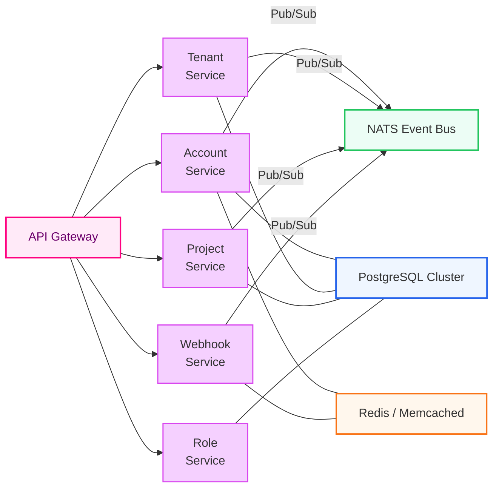

# Scalable SaaS Backend

> **Production-ready, multi-tenant backend boilerplate built with NestJS + TypeScript + PostgreSQL.**  
> Supports isolated tenant data, CQRS/event sourcing, NATS event bus, JWT auth, role-based access control, and Docker-first deployment.

---

## ✨ Key Features

| ✔️ | Feature                         | Why it matters                                                              |
|----|---------------------------------|-----------------------------------------------------------------------------|
| 🏘️ | **Multi-Tenancy**               | Serve any number of schools/clients from one code-base with hard isolation  |
| 🛡️ | **JWT Auth + RBAC**             | Secure login & fine-grained permissions (Admin, Teacher, Student …)         |
| 📯 | **Event-Driven Micro-services** | Services communicate over NATS, enabling loose coupling & real-time events  |
| 🗃️ | **CQRS + Event Store**          | Clear read/write separation, full audit trail & replayability               |
| 🚦 | **Consul Health & Discovery**   | Self-registered services, automatic fail-over                               |
| 🐳 | **First-class Docker**          | `docker compose up` brings the entire stack online in minutes               |
| 📈 | **Observability**               | Prometheus-ready metrics, structured logs, Swagger & GraphQL playground     |

---

## 🌐 System Architecture




## 🛠️ Tech Stack

| Category        | Technology                    |
|-----------------|-------------------------------|
| **Language**    | TypeScript (ES2022)            |
| **Framework**   | NestJS 10                     |
| **Database**    | PostgreSQL 15 (TypeORM)        |
| **Event Bus**   | NATS 2.x                       |
| **Cache / Jobs**| Redis 7 (+ Bull)               |
| **Auth**        | Passport + JWT                 |
| **Containers**  | Docker & docker-compose        |


## ⚡ Quick Start

### 1 — Prerequisites

| Tool            | Version       |
|-----------------|----------------|
| Node.js         | ≥ 20            |
| Docker Compose  | ≥ 2.20          |
| Make (optional) | For helper scripts |

---

### 2 — Clone & Boot

```bash
# Clone repo
git clone https://github.com/your-handle/scalable-saas-backend.git
cd scalable-saas-backend

# Copy environment template
cp .env.example .env
# (Edit DB passwords, JWT secret, NATS config, etc.)

# Launch everything
docker compose up --build -d

# Playgrounds
# REST API    : http://localhost:3000/api
# GraphQL     : http://localhost:3000/graphql
# Swagger UI  : http://localhost:3000/swagger
# Consul UI   : http://localhost:8500

### 3 — Run a Single Service Locally

```bash
pnpm i          # or npm i / yarn
pnpm --filter service-account start:dev
```

### 4 — Run All Services in Parallel
```bash
pnpm dev
```
## 🧪 Tests
```bash
pnpm test        # unit tests
pnpm test:e2e    # end-to-end HTTP tests
```

## 📈 Observability

- **Health Check**: `GET /health` (liveness & readiness probes)
- **Metrics**: `GET /metrics` (Prometheus scraping endpoint)
- **Logs**: Structured JSON via Winston logger  
  (can be shipped to external systems like Loki, ELK stack, or Datadog)


## 🤝 Contributing

1. Fork and clone this repository.
2. Install dependencies:
   ```bash
   pnpm install  # or npm install / yarn
   ```
3. Create a feature branch:
   ```bash
   git checkout -b feature/your-feature-name
   ```
4. Commit changes following the Conventional Commits format.
5. Push and open a Pull Request to the main branch.
6. GitHub Actions will automatically run tests and Snyk scans.
   
